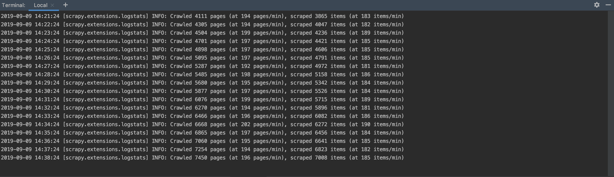

# CSDNHub
> 免责声明：本项目旨在学习，不可使用于商业和个人其他意图。若使用不当，均由个人承担。

[](./LICENSE)

<!-- [](https://github.com/hsowan/CSDNHub) -->


GitHub: https://github.com/hsowan/CSDNHub  
码云: https://gitee.com/hsowan/CSDNHub

Scrapy + Selenium + Dingtalk + MongoDB + Docker 爬取CSDN资源
(scrapy快速搭建爬虫项目, selenium用于爬取资源下载地址, dingtalk用于线上实时监控, mongodb用于存放资源信息, docker实现应用快速部署)

Speed: 每分钟爬取近200个资源 (8c16g)


Website: https://download.csdn.net/

API: https://download.csdn.net/index.php/source/ajax_get_more_code?pageno=1&pagesize=20
(该接口数据存在随机性, 通过创建唯一索引确保资源唯一)

```sh
# Dingtalk settings
DINGTALK_ACCESS_TOKEN = ''
DINGTALK_AT = []

# dev
pipenv install --python 3
pipenv run scrapy crawl Resource

# deploy
docker-compose up -d
```

Documentations:
* [Scrapy 1.7 documentation](https://docs.scrapy.org/en/latest/)
* [Pipenv: Python Dev Workflow for Humans](https://pipenv.readthedocs.io/en/latest/)
* [Requests: HTTP for Humans](https://2.python-requests.org/en/master/)
* [Selenium with Python](https://selenium-python.readthedocs.io/)
* [SeleniumHQ/docker-selenium](https://github.com/SeleniumHQ/docker-selenium)
* [PyMongo 3.9.0 documentation](https://api.mongodb.com/python/current/tutorial.html)
* [XPath 教程](https://www.runoob.com/xpath/xpath-tutorial.html)
* [Dingtalk webhook robot](https://ding-doc.dingtalk.com/doc#/serverapi2/qf2nxq)

相关项目: [CSDNBot](https://github.com/hsowan/CSDNBot)

关注个人公众号  


